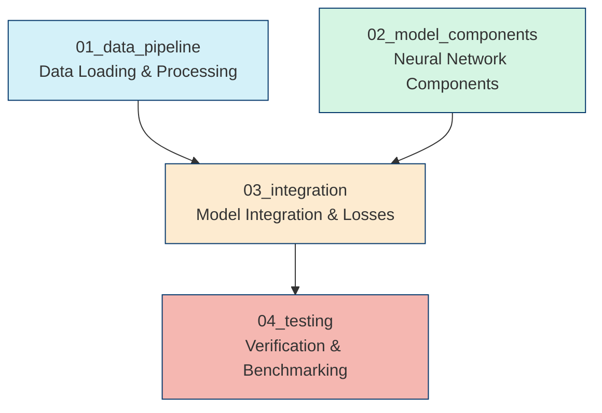

# RNA 3D Folding Project: Multi-Instance Claude Code Architecture

## 1. Overview: The Multi-Instance Approach

The RNA 3D folding machine learning pipeline is implemented using a specialized multi-instance Claude Code architecture. Rather than using a single AI instance for the entire project, we've divided development across four specialized instances, each focused on specific components of the system.

### Why Multiple Instances?

- **Specialized Expertise**: Each instance develops deeper specialization in its component group
- **Context Optimization**: Maximizes the effective use of context windows by focusing on related components
- **Clear Boundaries**: Well-defined responsibilities reduce overlap and integration issues
- **Parallel Development**: Different component groups can progress simultaneously
- **Knowledge Continuity**: Structured handoffs and documentation preserve insights across the project

### The Four Specialized Instances



## 2. Communication and Knowledge Sharing

The success of the multi-instance approach relies on structured communication and knowledge sharing:

### Implementation Journals

Each instance maintains detailed implementation journals that track:
- Completed components with timestamps
- Deviations from plans and rationale
- Outstanding issues and questions
- Next steps and priorities

Example journal structure:
```markdown
# Data Pipeline Implementation Status

| Component               | Status      | Tests | Interface Doc |
|-------------------------|-------------|-------|---------------|
| load_coordinates()      | ✅ Complete | ✅    | ✅           |
| load_features()         | 🟡 Partial  | ⬜    | ⬜           |
| RNADataset.__init__()   | ⬜ Pending  | ⬜    | ⬜           |

## Implementation Session: 2025-04-15

### Components Completed:
- [x] load_coordinates() function
- [x] load_precomputed_features() function (partial)

### Deviations from Plan:
- Added expanded error handling for missing MI files

### Issues/Questions:
- Unclear how to handle NaN values in angle data

### Next Steps:
- Complete feature loading with error handling
```

### Interface Contracts

Formal interface specifications ensure consistency across instances:
- Input/output tensor shapes and types
- Error conditions and handling
- Implementation requirements
- Verification tests

### Handoff Procedure

When one instance completes work that another depends on:
1. **Provider**: Completes implementation with tests, generates interface documentation
2. **Consumer**: Reviews documentation, runs verification tests, reports any issues
3. **Resolution**: If mismatches occur, follow the conflict resolution protocol

## 3. Directory Structure

The multi-instance documentation is organized as follows:

```
rna_3d_project/
└── docs/
    └── claude/
        ├── components/  (existing component guides)
        ├── workflows/   (existing workflow guides)
        ├── reference/   (existing reference docs)
        └── code-instances/  (multi-instance architecture)
            ├── README.md  (this document)
            ├── shared/
            │   ├── interface_specifications/  (shared interface contracts)
            │   ├── component_checklists/      (implementation requirements)
            │   └── handoff_templates/         (templates for transitions)
            │
            ├── 01_data_pipeline.md           (instance instructions)
            ├── 02_model_components.md        (instance instructions)
            ├── 03_integration.md             (instance instructions)
            ├── 04_testing.md                 (instance instructions)
            │
            └── coordination/
                ├── component_status.md       (global implementation status)
                ├── interface_registry.md     (all component interfaces)
                └── decision_log.md           (key technical decisions)
```

## 4. Instance Responsibilities Quick Reference

| Instance | Core Responsibilities | Key Interfaces |
|----------|------------------------|----------------|
| **01_data_pipeline** | • RNA dataset class<br>• Feature loading utilities<br>• Collate function<br>• Data preprocessing | • Tensor formats for model consumption<br>• Path parameterization<br>• Error handling for data issues |
| **02_model_components** | • Embedding layers<br>• Transformer blocks<br>• IPA module<br>• Component unit tests | • Input/output tensor shapes<br>• Configuration handling<br>• Mask propagation |
| **03_integration** | • Main model class<br>• Loss functions<br>• Configuration management<br>• Component assembly | • Model initialization<br>• Loss combinations<br>• Forward pass flow |
| **04_testing** | • Test suite development<br>• Edge case testing<br>• Integration tests<br>• Performance benchmarking | • Test fixtures<br>• Coverage verification<br>• Performance metrics |

## 5. When to Use Which Instance

Use this guide to determine which Claude Code instance to activate for different tasks:

### 01_data_pipeline
- When implementing or modifying data loading functions
- For issues with dataset creation or batch collation
- To address preprocessing of RNA sequences or features
- When optimizing data loading performance

### 02_model_components
- For neural network architectural components
- When working on embedding layers or transformers
- For attention mechanisms or tensor operations
- To optimize individual model components

### 03_integration
- To assemble the full model architecture
- When connecting data pipeline to model components
- For loss function implementation or combination
- To handle model configuration or hyperparameters

### 04_testing
- To develop comprehensive test cases
- For integration testing across components
- When benchmarking performance or memory usage
- To verify compatibility with Kaggle requirements

### Decision Flow

```
Does the task involve:
├── Data loading or preprocessing? → 01_data_pipeline
├── Neural network components? → 02_model_components
├── Connecting components or losses? → 03_integration
└── Verification or benchmarking? → 04_testing
```

## 6. Key Documents

### Instance Instruction Files
- [01_data_pipeline.md](./01_data_pipeline.md)
- [02_model_components.md](./02_model_components.md)
- [03_integration.md](./03_integration.md)
- [04_testing.md](./04_testing.md)

### Coordination Documents
- [Component Status](./coordination/component_status.md)
- [Interface Registry](./coordination/interface_registry.md)
- [Decision Log](./coordination/decision_log.md)

### Templates and Protocols
- [Interface Contract Template](./shared/interface_specifications/template.md)
- [Handoff Protocol](./shared/handoff_templates/protocol.md)
- [Implementation Checklist](./shared/component_checklists/checklist.md)

## Getting Started

To begin using the multi-instance architecture:

1. Review this README thoroughly to understand the overall structure
2. Identify which instance is appropriate for your current task
3. Study that instance's instruction file for detailed guidance
4. Review any relevant interface contracts for components you'll interact with
5. Follow the activation pattern in the instance's instruction file

For handoffs between instances, follow the [Handoff Protocol](./shared/handoff_templates/protocol.md) to ensure smooth transitions.

---

The multi-instance Claude Code architecture provides a structured, efficient approach to implementing our complex RNA 3D folding pipeline. By following these guidelines, we maintain clear boundaries while ensuring seamless integration across components.
