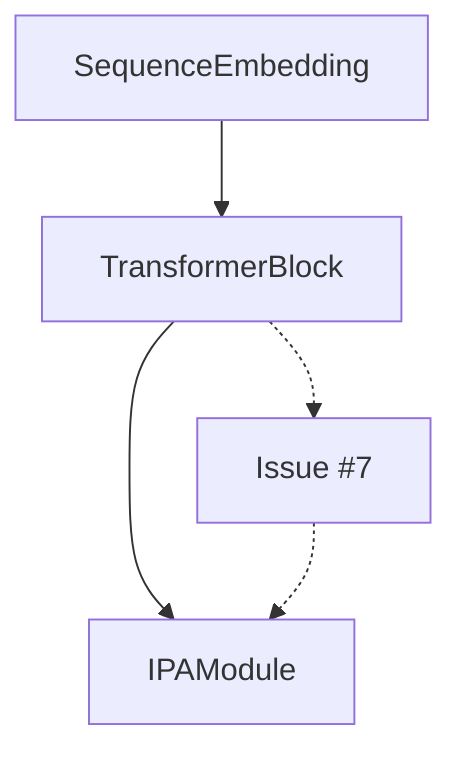
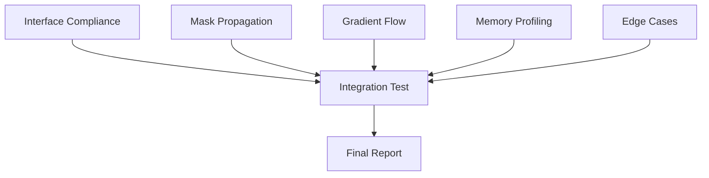

# Advanced RNA 3D Folding Project Reference Guide

## Table of Contents
1. [Introduction](#introduction)
2. [Advanced Knowledge Management Techniques](#advanced-knowledge-management-techniques)
   - [Specialized Documentation Structure](#specialized-documentation-structure)
   - [Implementation Journal Best Practices](#implementation-journal-best-practices)
   - [Knowledge Synchronization Mechanisms](#knowledge-synchronization-mechanisms)
3. [Context Window Optimization Strategies](#context-window-optimization-strategies)
   - [Document Summarization Techniques](#document-summarization-techniques)
   - [Progressive Disclosure Pattern](#progressive-disclosure-pattern)
   - [Focused Loading and Reloading Strategies](#focused-loading-and-reloading-strategies)
4. [Enhanced Interface Management](#enhanced-interface-management)
   - [Formal Interface Contract Implementation](#formal-interface-contract-implementation)
   - [Interface Verification System](#interface-verification-system)
   - [Living Interface Registry](#living-interface-registry)
5. [Specialized Prompt Engineering](#specialized-prompt-engineering)
   - [Instance Activation Prompts](#instance-activation-prompts)
   - [Task Assignment Prompts](#task-assignment-prompts)
   - [Communication Prompts](#communication-prompts)
6. [Advanced Handoff Procedures](#advanced-handoff-procedures)
   - [Detailed Verification Steps](#detailed-verification-steps)
   - [Issue Classification and Resolution](#issue-classification-and-resolution)
   - [Handoff Workflow Optimization](#handoff-workflow-optimization)
7. [Challenge Mitigation Strategies](#challenge-mitigation-strategies)
   - [Context Window Management](#context-window-management)
   - [Cross-Instance Consistency Enforcement](#cross-instance-consistency-enforcement)
   - [Knowledge Continuity Safeguards](#knowledge-continuity-safeguards)
8. [Conclusion and Recommendations](#conclusion-and-recommendations)

## Introduction

This advanced reference guide provides specialized techniques, patterns, and strategies for the RNA 3D folding project that supplement the core principles found in the master guide and implementation principles. It focuses on complex scenarios, edge cases, and advanced approaches that enhance the multi-instance development architecture.

While the [master guide](../00-master_guide.md) provides the overall framework and the [implementation principles](../01_implementation_principles.md) establish foundational patterns, this document offers deeper insights into specialized areas that may prove valuable in addressing complex challenges throughout development.

## Advanced Knowledge Management Techniques

### Specialized Documentation Structure

Beyond the basic documentation structure outlined in the master guide, implement this enhanced structure for optimal knowledge organization:

```
docs/claude/
├── code-instances/
│   ├── shared/                      # Common reference materials
│   │   ├── interface_specifications/    # Detailed interface contracts
│   │   ├── component_checklists/        # Implementation requirements
│   │   └── handoff_templates/           # Templates for transitions
│   │
│   ├── instance_01_data/            # Data pipeline instance documents
│   │   ├── implementation_journal.md    # Progress tracking
│   │   ├── completed_components.md      # Finished work record
│   │   └── interface_exports.md         # Officially provided interfaces
│   │
│   ├── instance_02_models/          # Similar structure for model components
│   ├── instance_03_integration/     # Similar structure for integration
│   ├── instance_04_testing/         # Similar structure for testing
│   │
│   └── coordination/                # Cross-instance coordination
│       ├── component_status.md          # Global implementation status
│       ├── interface_registry.md        # All component interfaces
│       └── decision_log.md              # Key technical decisions
```

This structure creates clear separation between instance-specific knowledge while providing centralized locations for cross-instance coordination artifacts. It supports specialized workflows while maintaining overall project coherence.

### Implementation Journal Best Practices

While the basic implementation journal template is covered elsewhere, these advanced practices enhance knowledge continuity:

#### Session Records with Contextual Linking

```markdown
## Implementation Session: 2025-04-15

### Context
- Continuing from [previous session](./implementation_journal.md#implementation-session-2025-04-12)
- Addressing [verification feedback](../instance_04_testing/verification_reports/TransformerBlock_verification.md)
- Implementing based on [interface contract v1.2](../shared/interface_specifications/TransformerBlock_v1.2.md)

### Components Completed:
- [x] TransformerBlock.forward() mask handling
  - Resolved [issue #3](../coordination/issues/issue_3.md): incorrect mask propagation
  - Implemented bidirectional mask transformation (bool → attention mask → bool)
  - **Key insight**: Attention masks use 0 for valid positions, -inf for padding
```

This enhanced format provides:
- Explicit knowledge lineage through hyperlinks
- Contextual anchoring to other documents
- Highlighted insights and critical decisions
- Issue references and resolution tracking

#### Component Status with Dependency Visualization

Enhance component status tracking with dependency visualization:

```markdown
# Transformer Components Status

| Component | Status | Dependencies | Blockers |
|-----------|--------|--------------|----------|
| SequenceEmbedding | ✅ Complete | None | None |
| TransformerBlock | 🟡 In Progress | SequenceEmbedding | None |
| IPAModule | ⬛ Blocked | TransformerBlock | Issue #7 |

## Dependency Graph

```

This visualization helps identify critical path components and highlights dependency chains that may cause cascading delays.

### Knowledge Synchronization Mechanisms

Implement these additional mechanisms to ensure knowledge consistency across instances:

#### 1. Synchronized Checkpoint Meetings

Schedule periodic "virtual checkpoints" where all instances align on critical aspects:

```markdown
# Checkpoint Meeting: 2025-04-18

## Attendees
- Instance 01: Data Pipeline
- Instance 02: Model Components
- Instance 03: Integration
- Instance 04: Testing

## Interface Alignment
- Consensus: `mask` tensors use True for valid positions, False for padding
- Consensus: All embeddings maintain input device
- Open Issue: Gradient checkpointing implementation (assigned to Instance 03)

## Component Status
- RNADataset: Completed and verified
- Transformer: In progress, expected completion 2025-04-22
- Loss Functions: Blocked by transformer completion

## Action Items
- Instance 02: Document transformer mask handling by 2025-04-20
- Instance 03: Propose gradient checkpointing approach by 2025-04-21
- Instance 04: Prepare verification test suite for transformer by 2025-04-21
```

#### 2. Decision Log

Maintain a centralized decision log that documents significant design decisions, alternatives considered, and rationale:

```markdown
# Decision Log

| ID | Date | Decision | Rationale | Alternatives | Instances Affected |
|----|------|----------|-----------|--------------|-------------------|
| D01 | 2025-04-15 | Use standard nn.MultiheadAttention | Enables future optimization via CUDA kernels | Custom attention implementation | 02, 03 |
| D02 | 2025-04-16 | Implement simplified IPA for V1 | Establishes correct interfaces while deferring complexity | Full IPA implementation | 02, 03 |
| D03 | 2025-04-17 | Store MI matrices as sparse tensors | Memory optimization for long sequences | Dense tensors with zeroing | 01, 03 |
```

This log provides historical context for technical decisions and helps new contributors understand why certain approaches were chosen over alternatives.

## Context Window Optimization Strategies

### Document Summarization Techniques

When working with Claude's context window limitations, use these summarization approaches to maximize information density:

#### Prioritized Content Extraction

For large documents that exceed context limitations:

```markdown
# Architecture Specification (Summarized)

## Priority Content: Tensor Shapes and Interface Requirements

### Residue Representation
- Input: (B, L, F_res) where F_res = seq_dim + dihedral_dim + entropy_dim
- Processed: (B, L, D_res) where D_res is the configured residue dimension
- Output: (B, L, D_res) with updated information

### Pair Representation
- Input: (B, L, L, F_pair) where F_pair = pairing_probs_dim + coupling_matrix_dim
- Processed: (B, L, L, D_pair) where D_pair is the configured pair dimension
- Output: (B, L, L, D_pair) with updated information
```

This technique extracts precisely what's needed for implementation while omitting verbose explanations.

#### Content-Type Prioritization

When managing multiple document types:

1. **Interface Contracts**: Highest priority - include complete
2. **Implementation Code**: Include relevant snippets only
3. **Explanatory Text**: Summarize core concepts
4. **Examples**: Include one representative example
5. **Background Information**: Omit unless directly relevant

### Progressive Disclosure Pattern

Implement a staged disclosure approach to maximize context relevance:

#### Initial Context Loading

```
1. Load high-level architecture overview
2. Load specific component interface contracts
3. Load immediate implementation task description
```

#### On-Demand Detail Loading

```
"Now, please load the detailed implementation guide for the transformer block attention mechanism, focusing specifically on mask handling."
```

#### Context Replacement

```
"We've completed the embedding implementation. Let's clear that context and load the transformer block specifications instead."
```

### Focused Loading and Reloading Strategies

When working on complex components that require extensive context:

#### Component-Focused Context Loading

```
"For this session, we'll focus exclusively on the IPAModule implementation. Please load:
1. IPAModule interface contract
2. Simplified IPA implementation guide
3. Integration points with TransformerBlock
4. Example usage patterns
5. Current implementation status from the journal"
```

#### Incremental Context Management

```
"Let's retain the core interface contract but replace the implementation guide with the testing requirements document."
```

This approach treats context as a limited, managed resource that should be optimized for the current implementation task.

## Enhanced Interface Management

### Formal Interface Contract Implementation

While the basic interface contract template is covered in the implementation principles, these advanced techniques enhance interface clarity:

#### Tensor Flow Diagrams

For complex components, include tensor flow diagrams in the interface contract:

```markdown
## Transformer Block Tensor Flow

Input Tensors:
  residue_repr(B,L,D_res) ─────┐
  pair_repr(B,L,L,D_pair) ─────┤
  mask(B,L) ───────────────────┘
                                │
                                ▼
┌─────────────────────────────────────────┐
│                                         │
│  ┌─────────────────┐    ┌─────────────┐ │
│  │ Layer Norm      │    │ Layer Norm  │ │
│  └────────┬────────┘    └──────┬──────┘ │
│           │                     │        │
│  ┌────────▼────────┐    ┌──────▼──────┐ │
│  │ Self-Attention  │    │ Pair Update │ │
│  └────────┬────────┘    └──────┬──────┘ │
│           │                     │        │
│           ▼                     ▼        │
│  residue_repr'            pair_repr'     │
│                                         │
└─────────────────────────────────────────┘
                   │
                   ▼
Output Tensors:
  residue_repr'(B,L,D_res)
  pair_repr'(B,L,L,D_pair)
```

This visualization provides an immediate understanding of data flow that complements the textual description.

#### Interface Evolution Tracking

For interfaces that evolve during development, include a detailed changelog:

```markdown
## Interface Evolution

| Version | Date | Changes | Rationale | Backward Compatible |
|---------|------|---------|-----------|---------------------|
| v1.0    | 2025-04-10 | Initial version | - | - |
| v1.1    | 2025-04-15 | Added `return_attention` parameter | Enable attention visualization | Yes |
| v1.2    | 2025-04-18 | Changed mask format from float to bool | Consistency with other components | No |
```

This changelog helps track breaking changes and understand the evolution of component interfaces.

#### Cross-Component Interaction Guides

Include explicit guidance for common integration patterns:

```markdown
## Integration with Other Components

### Residue Projection Layer

The transformer block expects residue representations to be pre-projected to the correct dimension. Use the projection layer before passing to the transformer:

```python
residue_features = torch.cat([
    sequence_embedding,            # (B, L, S)
    dihedral_features,             # (B, L, 4)
    positional_entropy.unsqueeze(-1)  # (B, L, 1)
], dim=-1)

residue_repr = self.residue_projection(residue_features)  # (B, L, D_res)
```

### Mask Propagation Pattern

Masks must be transformed from boolean format to attention format:

```python
# Convert boolean mask (True=valid) to attention mask (0=attend, -inf=ignore)
attention_mask = (~mask).float() * -1e9
```
```

These integration guides prevent common interoperability issues across components.

### Interface Verification System

Implement an explicit interface verification step in the handoff process:

#### Schema Validation Function

```python
def verify_interface_compliance(component, interface_contract, input_example):
    """
    Verify component implements interface according to contract.
    
    Args:
        component: The component to verify
        interface_contract: Interface specification
        input_example: Example inputs matching expected interface
        
    Returns:
        Dict of verification results
    """
    results = {
        "input_validation": [],
        "output_validation": [],
        "error_handling": [],
        "device_handling": []
    }
    
    # Verify input handling
    for param_name, expected in interface_contract["inputs"].items():
        # Check parameter exists and has correct type
        if param_name not in input_example:
            results["input_validation"].append(f"Missing input: {param_name}")
            continue
            
        actual = input_example[param_name]
        
        # Check shape compatibility
        if hasattr(actual, "shape") and hasattr(expected, "shape"):
            if not _is_shape_compatible(actual.shape, expected.shape):
                results["input_validation"].append(
                    f"Shape mismatch for {param_name}: expected {expected.shape}, got {actual.shape}"
                )
    
    # Verify output format
    try:
        output = component(**input_example)
        
        # Check output structure
        for output_name, expected in interface_contract["outputs"].items():
            if output_name not in output:
                results["output_validation"].append(f"Missing output: {output_name}")
                continue
                
            actual = output[output_name]
            
            # Check shape compatibility
            if hasattr(actual, "shape") and hasattr(expected, "shape"):
                if not _is_shape_compatible(actual.shape, expected.shape):
                    results["output_validation"].append(
                        f"Shape mismatch for {output_name}: expected {expected.shape}, got {actual.shape}"
                    )
    except Exception as e:
        results["output_validation"].append(f"Exception during execution: {str(e)}")
    
    # More validation steps...
    
    return results

def _is_shape_compatible(actual, expected):
    """Check if actual shape is compatible with expected shape pattern."""
    if len(actual) != len(expected):
        return False
        
    for a, e in zip(actual, expected):
        # Handle dimensions specified as variables (B, L, etc.)
        if isinstance(e, str) and e.startswith('$'):
            continue
        # Handle exact dimension requirements
        if a != e:
            return False
            
    return True
```

#### Verification Test Generation

Automatically generate verification tests from interface contracts:

```python
def generate_verification_tests(interface_contract):
    """
    Generate pytest test cases from interface contract.
    
    Args:
        interface_contract: The interface specification
        
    Returns:
        String containing pytest test case
    """
    test_code = f"""
import torch
import pytest
from {interface_contract['module']} import {interface_contract['class']}

def test_{interface_contract['class']}_shape_handling():
    \"\"\"Verify {interface_contract['class']} handles tensor shapes correctly.\"\"\"
    # Initialize component with test configuration
    config = {interface_contract['test_config']}
    component = {interface_contract['class']}(config)
    
    # Create test inputs
    batch_sizes = [1, 4]
    seq_lengths = [10, 100]
    
    for batch_size in batch_sizes:
        for seq_len in seq_lengths:
            # Create input tensors
            inputs = {{
"""
    
    # Generate input tensor creation
    for param_name, param_spec in interface_contract['inputs'].items():
        if param_spec['type'] == 'torch.Tensor':
            shape_str = param_spec['shape'].replace('B', 'batch_size').replace('L', 'seq_len')
            test_code += f"""                '{param_name}': torch.randn({shape_str}, dtype=torch.{param_spec['dtype']}),
"""
    
    test_code += """            }
            
            # Forward pass
            outputs = component(**inputs)
            
            # Verify output shapes
"""
    
    # Generate output shape verification
    for output_name, output_spec in interface_contract['outputs'].items():
        shape_str = output_spec['shape'].replace('B', 'batch_size').replace('L', 'seq_len')
        test_code += f"""            assert outputs['{output_name}'].shape == ({shape_str}), f"Unexpected shape for {output_name}"
"""
    
    test_code += """
def test_{interface_contract['class']}_mask_handling():
    \"\"\"Verify {interface_contract['class']} handles masks correctly.\"\"\"
    # Similar test implementation for mask handling
    
    pass
"""
    
    return test_code
```

This automated test generation ensures consistent verification across all components, reducing the likelihood of interface mismatches.

### Living Interface Registry

The living interface registry is a centralized, dynamically updated record of all component interfaces:

```markdown
# Interface Registry

| Component | Latest Version | Last Updated | Status | Breaking Changes | Dependencies |
|-----------|----------------|--------------|--------|------------------|--------------|
| `RNADataset` | v1.2 | 2025-04-15 | ✅ Stable | No | None |
| `SequenceEmbedding` | v1.0 | 2025-04-12 | ✅ Stable | No | None |
| `TransformerBlock` | v1.1 | 2025-04-18 | 🟡 Evolving | No | None |
| `IPAModule` | v0.5 | 2025-04-16 | 🔴 Draft | Yes | TransformerBlock |

## Latest Interface Changes

### TransformerBlock v1.1 (2025-04-18)
- Added optional `return_attention_weights` parameter (default: False)
- When True, returns attention weights in the output dictionary
- No breaking changes to existing interface

### RNADataset v1.2 (2025-04-15)
- Added `update_available_features()` method to refresh available features
- Added metadata flags to track feature presence
- No breaking changes to existing interface
```

The registry provides:
- At-a-glance view of all component interfaces
- Status indicators for interface stability
- Tracking of breaking changes
- Dependency relationships between components
- Recent change history for context

## Specialized Prompt Engineering

### Instance Activation Prompts

Use these standardized prompts when activating specific Claude Code instances:

#### Data Pipeline Activation

```
I'm working on the RNA 3D folding project and need to activate the Data Pipeline instance (01_data_pipeline) to implement [specific component]. Please:

1. Review docs/claude/03_code-instances/01_data_pipeline.md
2. Load docs/claude/04_reference/feature_formats.md for reference
3. Check docs/claude/03_code-instances/instance_01_data/implementation_journal.md for current status

After reviewing these documents, please begin implementing [component] with particular attention to [specific aspect], ensuring strict path parameterization throughout.
```

#### Model Components Activation

```
I'm working on the RNA 3D folding project and need to activate the Model Components instance (02_model_components) to implement [specific component]. Please:

1. Review docs/claude/03_code-instances/02_model_components.md
2. Load docs/claude/02_components/[relevant component guide] for reference
3. Check docs/claude/03_code-instances/instance_02_model/implementation_journal.md for current status
4. Review any interface contracts from dependent components

After reviewing these documents, please begin implementing [component] with particular attention to [specific aspect], ensuring proper tensor shape management throughout.
```

#### Integration Activation

```
I'm working on the RNA 3D folding project and need to activate the Integration instance (03_integration) to implement [specific component]. Please:

1. Review docs/claude/03_code-instances/03_integration.md
2. Load interface contracts for all components being integrated
3. Check docs/claude/03_code-instances/instance_03_integration/implementation_journal.md for current status
4. Review handoff documentation from dependent components

After reviewing these documents, please begin integrating [component] with particular attention to proper data flow and configuration management.
```

#### Testing Activation

```
I'm working on the RNA 3D folding project and need to activate the Testing instance (04_testing) to implement [specific tests]. Please:

1. Review docs/claude/03_code-instances/04_testing.md
2. Load interface contracts for components being tested
3. Check docs/claude/03_code-instances/instance_04_testing/implementation_journal.md for current status
4. Review verification requirements in handoff documentation

After reviewing these documents, please begin implementing tests for [component] with particular attention to edge cases and thorough verification.
```

### Task Assignment Prompts

When assigning specific implementation tasks, use this structured format:

```
Now that we've established the context, please implement [specific component/function] with the following requirements:

1. Input Interface:
   - [parameter_name]: [type] - [shape description] - [purpose]
   - [parameter_name]: [type] - [shape description] - [purpose]

2. Output Interface:
   - [return_value]: [type] - [shape description] - [purpose]

3. Error Handling:
   - Check for [specific error condition] and raise [exception type] with descriptive message
   - Handle [edge case] by [approach]

4. Key Algorithms:
   - Implement [algorithm name/approach] for [specific functionality]
   - Ensure [critical property] is maintained throughout

5. Test Cases to Consider:
   - Normal operation with [typical input parameters]
   - Edge case: [specific edge case]
   - Error case: [specific error condition]

After implementation, please also provide:
- Inline comments explaining complex logic
- Docstring with clear input/output documentation
- Brief explanation of key implementation decisions
```

### Communication Prompts

#### Cross-Instance Communication

When information from another instance is needed:

```
We need to establish the interface with [component] from Claude Code Instance [number]. Based on the current implementation, please:

1. Document our current understanding of the interface requirements:
   - Expected input parameters and tensor shapes
   - Expected output formats
   - Error handling expectations
   - Device management requirements

2. Identify any ambiguities or questions we need to clarify:
   - [specific question about interface]
   - [specific question about behavior]

3. Draft a formal interface clarification request that we can share with Instance [number].
```

#### Handoff Documentation

When completing a component that other instances depend on:

```
We've completed [component name]. Let's create thorough interface documentation for Claude Code Instance [number] that will be implementing [dependent component]:

1. Complete Interface Contract:
   - Create a formal interface contract following the template
   - Include all input parameters with shapes and types
   - Specify all output formats with shapes and types
   - Document error conditions and handling
   - Provide device management details

2. Example Usage:
   - Create concrete examples with realistic dimensions
   - Show typical usage patterns
   - Demonstrate error handling

3. Implementation Notes:
   - Document any non-obvious implementation details
   - Explain key design decisions
   - Note any limitations or constraints
   - Provide optimization guidance

4. Verification Steps:
   - Detail how to verify correct implementation
   - Provide expected outputs for specific inputs
   - Suggest test cases covering normal usage and edge cases
```

#### Progress Check Prompts

For periodic check-ins on implementation progress:

```
Let's review our progress on the [component group] implementation:

1. Completed components:
   - [List completed components with verification status]

2. Current focus:
   - [Current component being implemented]
   - [Major challenges or decisions]
   - [Estimated completion timeline]

3. Remaining components:
   - [List remaining components with dependencies]
   - [Priority order]

4. Open Questions:
   - [List questions requiring resolution]
   - [Note which instances could provide answers]

5. Next Steps:
   - [Immediate next actions]
   - [Upcoming handoffs to prepare]
```

## Advanced Handoff Procedures

### Detailed Verification Steps

Enhance the standard handoff protocol with these detailed verification steps:

#### 1. Comprehensive Interface Verification

```markdown
## Interface Verification Checklist

| Verification Aspect | Method | Result | Notes |
|---------------------|--------|--------|-------|
| **Input Parameters** |
| Parameter count | Count matches spec | ✅ Pass | All 3 required parameters present |
| Parameter names | Match interface contract | ✅ Pass | Names match exactly |
| Parameter types | Type checking | ✅ Pass | All types match contract |
| Parameter shapes | Shape validation | ⚠️ Warning | `feature_dim` flexible rather than fixed |
| Default values | Check against spec | ✅ Pass | Default values match contract |
| **Output Format** |
| Return structure | Type checking | ✅ Pass | Dictionary with expected keys |
| Output shapes | Shape validation | ✅ Pass | All output tensors have correct shapes |
| Output types | Type checking | ✅ Pass | All output types match contract |
| **Error Handling** |
| Missing parameters | Test with missing params | ✅ Pass | Clear error message provided |
| Invalid types | Test with wrong types | ✅ Pass | TypeError with descriptive message |
| Shape mismatches | Test with wrong shapes | ✅ Pass | ValueError with shape information |
| **Device Handling** |
| Device propagation | Test with CPU/CUDA | ✅ Pass | Output devices match input devices |
| Mixed devices | Test with mixed devices | ❌ Fail | Error when mixing CPU/CUDA inputs |
| **Performance** |
| Memory usage | Profile with realistic inputs | ⚠️ Warning | Higher than expected for large L |
| Computation time | Benchmark with varying B,L | ✅ Pass | Scales as expected with B,L |
```

#### 2. Edge Case Testing Matrix

```markdown
## Edge Case Testing Matrix

| Test Case | Expected Behavior | Result | Notes |
|-----------|-------------------|--------|-------|
| **Empty Inputs** |
| batch_size=0 | Raise ValueError | ✅ Pass | "Empty batch not supported" |
| seq_len=0 | Raise ValueError | ✅ Pass | "Empty sequence not supported" |
| **Extreme Dimensions** |
| batch_size=1, seq_len=1 | Process correctly | ✅ Pass | Single residue handled correctly |
| batch_size=128, seq_len=10 | Process correctly | ✅ Pass | Large batch handled efficiently |
| batch_size=1, seq_len=1000 | Process correctly | ⚠️ Warning | High memory usage |
| **Sequence Length Variations** |
| Variable lengths in batch | Respect mask | ✅ Pass | Masked positions have zeros in output |
| All positions masked | Return zeros | ✅ Pass | All-zero output for fully masked input |
| No positions masked | Process all | ✅ Pass | Processes full sequence |
| **Numerical Stability** |
| Extreme values (±1e6) | Stable results | ⚠️ Warning | Large values cause gradient instability |
| Zero inputs | Produce valid output | ✅ Pass | Handles zero inputs gracefully |
| Random normal inputs | Stable results | ✅ Pass | Consistent results with random inputs |
| **Device Variations** |
| CPU execution | Functional | ✅ Pass | Works on CPU |
| CUDA execution | Functional | ✅ Pass | Works on CUDA |
| Device transfer | Maintain correctness | ✅ Pass | Results identical after device transfer |
```

#### 3. Memory and Performance Profiling

```markdown
## Memory and Performance Profile

### Memory Usage

| Configuration | Peak Memory | Notes |
|---------------|-------------|-------|
| B=1, L=100, D=128 | 24 MB | Base configuration |
| B=16, L=100, D=128 | 384 MB | Linear scaling with batch size |
| B=1, L=500, D=128 | 600 MB | Quadratic scaling with sequence length |
| B=1, L=100, D=256 | 48 MB | Linear scaling with model dimension |

### Forward Pass Timing

| Configuration | CPU Time | GPU Time | Notes |
|---------------|----------|----------|-------|
| B=1, L=100, D=128 | 15 ms | 3 ms | Base configuration |
| B=16, L=100, D=128 | 240 ms | 12 ms | GPU shows better batch parallelism |
| B=1, L=500, D=128 | 375 ms | 32 ms | Performance scales with sequence length |

### Backward Pass Timing

| Configuration | CPU Time | GPU Time | Notes |
|---------------|----------|----------|-------|
| B=1, L=100, D=128 | 30 ms | 5 ms | Base configuration |
| B=16, L=100, D=128 | 480 ms | 20 ms | GPU shows better batch parallelism |
| B=1, L=500, D=128 | 750 ms | 64 ms | Performance scales with sequence length |

### Optimization Recommendations

1. Use batch size B=16 for L≤100 for optimal GPU utilization
2. Reduce batch size to B=4 for L≤500 to avoid OOM errors
3. Consider gradient checkpointing for L>500
4. CPU execution only recommended for debugging
```

### Issue Classification and Resolution

Implement this structured approach for handling issues discovered during verification:

#### Issue Classification Framework

```markdown
## Issue Classification Matrix

| Severity | Impact on Integration | Resolution Timeline | Example |
|----------|------------------------|---------------------|---------|
| **Critical** | Blocks functionality | Immediate (24h) | Incorrect mask handling causes errors |
| **High** | Significant limitations | Short-term (72h) | Memory usage exceeds budget by >50% |
| **Medium** | Suboptimal behavior | Medium-term (1 week) | Performance scales poorly with sequence length |
| **Low** | Minor inconsistencies | Long-term (2 weeks) | Inconsistent parameter naming |
```

#### Structured Issue Report

```markdown
# Issue Report: Transformer Block Mask Handling

## Issue Information
- **Component**: TransformerBlock
- **Version**: v1.0
- **Identified By**: Instance 04 (Testing)
- **Identified On**: 2025-04-18
- **Severity**: Critical
- **Status**: Open

## Issue Description
The transformer block does not correctly propagate attention masks. When a batch contains variable-length sequences, the padding positions are not properly masked in self-attention, leading to invalid information propagation from padding tokens.

## Expected vs. Actual Behavior
- **Expected**: Padding positions (mask=False) should be excluded from attention calculations
- **Actual**: All positions attend to all other positions, including padding

## Reproduction Steps
1. Create batch with two sequences of different lengths:
   ```python
   batch = {
       "residue_repr": torch.randn(2, 10, 64),  # 2 sequences, max length 10
       "pair_repr": torch.randn(2, 10, 10, 32),
       "mask": torch.tensor([
           [True, True, True, True, True, False, False, False, False, False],  # Length 5
           [True, True, True, False, False, False, False, False, False, False]  # Length 3
       ])
   }
   ```
2. Pass through transformer block
3. Examine attention patterns using attention visualization

## Impact
- Corrupt information flow from padding positions
- Incorrect predictions for variable-length batches
- Inconsistent behavior between training and inference

## Technical Analysis
The issue occurs in the attention mask conversion:

```python
# Current implementation
def forward(self, residue_repr, pair_repr, mask):
    # No conversion from boolean mask to attention mask
    attn_output, _ = self.self_attn(residue_repr, residue_repr, residue_repr)
    # ...
```

The boolean mask (True=valid, False=padding) needs to be inverted and converted to float with -inf:

```python
# Correct implementation
def forward(self, residue_repr, pair_repr, mask):
    # Convert boolean mask to attention mask
    attention_mask = (~mask).float() * -1e9
    attn_output, _ = self.self_attn(
        residue_repr, residue_repr, residue_repr,
        attn_mask=attention_mask
    )
    # ...
```

## Resolution Recommendations
1. Modify TransformerBlock.forward to convert the boolean mask to an attention mask
2. Add explicit test case for variable-length sequences
3. Document the mask conversion pattern in the interface contract
4. Update any dependent components that may rely on current behavior

## Assigned To
Instance 02 (Model Components)

## Resolution Timeline
Critical severity requires resolution within 24 hours (by 2025-04-19)
```

#### Resolution Documentation

```markdown
# Issue Resolution: Transformer Block Mask Handling

## Issue Reference
- **Issue**: Transformer Block Mask Handling
- **Severity**: Critical
- **Identified On**: 2025-04-18

## Resolution Details
- **Implemented By**: Instance 02 (Model Components)
- **Resolved On**: 2025-04-19
- **Resolution Commit/Version**: TransformerBlock v1.1

## Implementation Changes
```python
def forward(self, residue_repr, pair_repr, mask=None):
    """
    Forward pass through transformer block with proper mask handling.
    
    Args:
        residue_repr: Tensor of shape (B, L, D_res)
        pair_repr: Tensor of shape (B, L, L, D_pair)
        mask: Boolean tensor of shape (B, L), True for valid positions
        
    Returns:
        updated_residue_repr: Tensor of shape (B, L, D_res)
        updated_pair_repr: Tensor of shape (B, L, L, D_pair)
    """
    # Layer normalization (pre-norm)
    normed_residue = self.residue_norm(residue_repr)
    normed_pair = self.pair_norm(pair_repr)
    
    # Apply attention with proper mask handling
    if mask is not None:
        # Convert boolean mask (True=valid) to attention mask (0=attend, -inf=ignore)
        attention_mask = (~mask).float() * -1e9
        
        # Ensure attention mask has proper shape for nn.MultiheadAttention
        # From: [batch_size, seq_len] 
        # To:   [batch_size, 1, seq_len]
        attention_mask = attention_mask.unsqueeze(1)
    else:
        attention_mask = None
    
    # Self-attention with mask
    attn_output, _ = self.self_attn(
        query=normed_residue,
        key=normed_residue,
        value=normed_residue,
        attn_mask=attention_mask
    )
    
    # Residual connection
    residue_repr = residue_repr + attn_output
    
    # Remaining implementation...
    
    return residue_repr, pair_repr
```

## Verification Results
- All test cases now pass, including variable-length sequences
- Attention visualization confirms proper masking
- Memory usage and performance unchanged
- No regression in other functionality

## Documentation Updates
- Interface contract updated to clarify mask format
- Added mask handling example to documentation
- Updated unit tests to include variable-length sequence test

## Lessons Learned
- Need explicit verification of mask propagation in all attention components
- Document mask transformation patterns consistently
- Include visualization tools in test suite for attention inspection
```

### Handoff Workflow Optimization

Streamline the handoff process with these advanced workflow optimizations:

#### Parallel Verification for Complex Components

For complex components with multiple verification aspects:

```markdown
# TransformerBlock Verification Strategy

## Parallel Verification Tasks

| Verification Aspect | Assigned To | Dependencies | Timeline |
|---------------------|-------------|--------------|----------|
| Interface Compliance | Tester A | None | Day 1 |
| Mask Propagation | Tester B | None | Day 1 |
| Gradient Flow | Tester C | None | Day 1 |
| Memory Profiling | Tester D | None | Day 1 |
| Edge Cases | Tester E | None | Day 1 |
| Integration Test | Integration Lead | All above tasks | Day 2 |

## Verification Workflow



## Verification Coordination
- Daily sync meeting at 10am to review progress
- Issues reported immediately upon discovery
- Final consolidation meeting after all tasks complete
- Verification report delivered within 48 hours of handoff
```

#### Incremental Handoff Process

For large components, use an incremental handoff approach:

```markdown
# Incremental Handoff: RNA Folding Model

## Handoff Schedule

| Milestone | Components | Dependencies | Target Date |
|-----------|------------|--------------|------------|
| **Phase 1** | Input Processing | None | 2025-04-15 |
| **Phase 2** | Transformer Backbone | Phase 1 | 2025-04-18 |
| **Phase 3** | IPA Module Integration | Phase 2 | 2025-04-20 |
| **Phase 4** | Prediction Heads | Phase 3 | 2025-04-22 |
| **Phase 5** | Full Model | All phases | 2025-04-25 |

## Incremental Verification Strategy
- Each phase verified independently
- Integration tests at each phase boundary
- Regression testing at each phase
- Final verification on complete assembly

## Milestone Criteria
- Unit tests pass (≥90% coverage)
- Integration tests pass
- Memory profile within budget
- Interface contract fully documented
- Example usage provided

## Rollback Plan
- Each phase has a verified checkpoint
- Dependencies explicitly documented
- Clean separation between phases
```

## Challenge Mitigation Strategies

### Context Window Management

Advanced strategies for Claude's context window limitations:

#### Token Budget Allocation

Optimize token usage across document types:

```markdown
# Token Budget Allocation for RNA Folding Model Development

| Document Type | Priority | Max Tokens | Retention Strategy |
|---------------|----------|------------|-------------------|
| Interface Contracts | Critical | 40% | Complete retention |
| Code Snippets | High | 30% | Relevant components only |
| Test Results | Medium | 15% | Key findings and failures |
| Background Information | Low | 15% | Summary only |

## Context Rotation Strategy

1. **Core Context** (Always Present):
   - Current implementation task
   - Interface contracts for current components
   - Current implementation status

2. **Rotating Context** (Load as Needed):
   - Related component implementations
   - Test results and error messages
   - Example usage patterns
   - Detailed architecture documentation

3. **Context Refresh Triggers**:
   - Completion of significant component
   - Transition to new implementation phase
   - Error resolution requiring new information
   - Context window approaching capacity limit
```

#### Document Chunking Strategy

For large reference documents that exceed context limits:

```markdown
# Document Chunking Strategy

## Chunk Types and Priority

| Chunk Type | When to Include | Value |
|------------|-----------------|-------|
| Component Interface | Always | Critical |
| Method Signatures | Always | Critical |
| Implementation Logic | As needed | High |
| Examples | On request | Medium |
| Background | On request | Low |

## Chunking Template

```
# [Component Name] Documentation - [Chunk Type]

## Quick Reference
- Component: [name]
- Purpose: [brief description]
- Dependencies: [list]
- Other Chunks: [Interface/Implementation/Examples/Background]

## Chunk Content
[Focused content for this chunk type]

## Navigation
- For method signatures, see Interface chunk
- For implementation details, see Implementation chunk
- For usage examples, see Examples chunk
- For background information, see Background chunk
```
```

### Cross-Instance Consistency Enforcement

Strategies to ensure consistency across instances:

#### Interface Compliance Matrix

Track interface compliance across all instances:

```markdown
# Interface Compliance Matrix

| Interface | Provider | Consumer | Contract Version | Provider Compliance | Consumer Compliance | Verification Status |
|-----------|----------|----------|------------------|---------------------|---------------------|---------------------|
| RNADataset | 01_data | 03_integration | v1.2 | ✅ Full | ✅ Full | ✅ Verified |
| SequenceEmbedding | 02_model | 03_integration | v1.0 | ✅ Full | ✅ Full | ✅ Verified |
| TransformerBlock | 02_model | 03_integration | v1.1 | ✅ Full | ⚠️ Partial | 🔄 In Progress |
| IPAModule | 02_model | 03_integration | v0.5 | ✅ Full | ❌ Non-compliant | ❌ Failed |

## Compliance Issues

### TransformerBlock (Consumer Partial Compliance)
- Integration instance using outdated mask handling pattern
- Fix: Update to match v1.1 contract mask transformation

### IPAModule (Consumer Non-compliance)
- Integration using incorrect input format
- Integration expecting different output tensor shape
- Fix: Align inputs/outputs with interface contract
```

#### Code Generation from Interface Contracts

Generate interface validation code directly from contracts:

```python
def generate_interface_validation(contract_path):
    """
    Generate validation code from interface contract.
    
    Args:
        contract_path: Path to interface contract markdown
        
    Returns:
        Python code for validation function
    """
    # Load and parse contract
    with open(contract_path, 'r') as f:
        contract_md = f.read()
    
    contract = parse_interface_contract(contract_md)
    
    # Generate validation function
    component_name = contract['component_name']
    validation_code = f"""
def validate_{component_name.lower()}_interface(component):
    \"\"\"
    Validate that component implements the {component_name} interface correctly.
    
    Args:
        component: Component instance to validate
        
    Returns:
        Dict of validation results
    \"\"\"
    results = {{
        "parameters": [],
        "outputs": [],
        "errors": []
    }}
    
    # Validate required parameters
"""
    
    # Generate parameter validation
    for param in contract['parameters']:
        if param['required']:
            validation_code += f"""
    # Validate {param['name']} parameter
    param_spec = inspect.signature(component.forward).parameters.get('{param['name']}')
    if param_spec is None:
        results["parameters"].append(f"Missing required parameter: {param['name']}")
    else:
        # Check parameter type hint if available
        if param_spec.annotation != inspect.Parameter.empty:
            if param_spec.annotation != {param['type']}:
                results["parameters"].append(
                    f"Parameter {param['name']} has incorrect type hint: "
                    f"expected {param['type']}, got {{param_spec.annotation}}"
                )
"""
    
    # Generate output validation logic
    validation_code += """
    # Validate outputs with test input
    try:
        # Create minimal test input
        test_input = {
"""
    
    # Generate test input creation
    for param in contract['parameters']:
        if param['required']:
            if 'torch.Tensor' in param['type']:
                shape_str = param['shape'].replace('B', '1').replace('L', '5')
                validation_code += f"""            '{param['name']}': torch.zeros({shape_str}),
"""
            elif param['type'] == 'bool':
                validation_code += f"""            '{param['name']}': True,
"""
            elif param['type'] == 'int':
                validation_code += f"""            '{param['name']}': 0,
"""
            else:
                validation_code += f"""            '{param['name']}': None,  # Placeholder for {param['type']}
"""
    
    validation_code += """        }
        
        # Run forward pass
        output = component.forward(**test_input)
        
        # Validate output structure
"""
    
    # Generate output validation
    for output in contract['outputs']:
        validation_code += f"""
        # Validate {output['name']} output
        if '{output['name']}' not in output:
            results["outputs"].append(f"Missing output: {output['name']}")
        elif not isinstance(output['{output['name']}'], {output['type']}):
            results["outputs"].append(
                f"Output {output['name']} has incorrect type: "
                f"expected {output['type']}, got {{type(output['{output['name']]')}}"
            )
"""
        
        if 'torch.Tensor' in output['type']:
            shape_parts = output['shape'].replace('B', '1').replace('L', '5').split(', ')
            validation_code += f"""
        # Validate {output['name']} shape
        elif output['{output['name']}'].dim() != {len(shape_parts)}:
            results["outputs"].append(
                f"Output {output['name']} has incorrect number of dimensions: "
                f"expected {len(shape_parts)}, got {{output['{output['name']}'].dim()}}"
            )
"""
    
    # Generate error validation
    for error in contract['errors']:
        validation_code += f"""
    # Validate {error['type']} error
    try:
        # Create input that should trigger the error
        error_input = {{}}  # TODO: Create input to trigger {error['type']}
        component.forward(**error_input)
        results["errors"].append(f"Failed to raise expected {error['type']} error")
    except {error['type']} as e:
        if "{error['message']}" not in str(e):
            results["errors"].append(
                f"Error message for {error['type']} does not contain expected content: "
                f"expected to include \\"{error['message']}\\", got {{str(e)}}"
            )
    except Exception as e:
        results["errors"].append(
            f"Wrong exception type for {error['condition']}: "
            f"expected {error['type']}, got {{type(e).__name__}}"
        )
"""
    
    validation_code += """
    return results
"""
    
    return validation_code
```

This code generation approach ensures that validation tests precisely match the interface contract specifications, reducing the chance of inconsistencies.

### Knowledge Continuity Safeguards

Implement these advanced safeguards to prevent knowledge loss between implementation sessions:

#### Implementation Snapshot Mechanism

Capture complete implementation context at regular intervals:

```markdown
# Implementation Snapshot: TransformerBlock (2025-04-18)

## Current Implementation Status
```python
class TransformerBlock(nn.Module):
    """
    Transformer block with self-attention and pair updates.
    
    Version: v1.1
    Responsible Instance: 02_model_components
    Last Updated: 2025-04-18
    """
    
    def __init__(self, config):
        super().__init__()
        self.residue_dim = config.get('residue_embed_dim', 128)
        self.pair_dim = config.get('pair_embed_dim', 64)
        self.num_heads = config.get('num_attention_heads', 4)
        
        # Validate dimensions
        if self.residue_dim % self.num_heads != 0:
            raise ValueError(
                f"residue_dim ({self.residue_dim}) must be divisible by "
                f"num_heads ({self.num_heads})"
            )
        
        # Layer normalization (pre-norm)
        self.residue_norm = nn.LayerNorm(self.residue_dim)
        self.pair_norm = nn.LayerNorm(self.pair_dim)
        
        # Multi-head attention
        self.self_attn = nn.MultiheadAttention(
            embed_dim=self.residue_dim,
            num_heads=self.num_heads,
            batch_first=True
        )
        
        # Feedforward for residue update
        self.residue_ff = nn.Sequential(
            nn.Linear(self.residue_dim, self.residue_dim * 4),
            nn.ReLU(),
            nn.Linear(self.residue_dim * 4, self.residue_dim)
        )
        
        # Simplified pair update (outer product + MLP)
        self.pair_update = nn.Sequential(
            nn.Linear(self.residue_dim * 2 + self.pair_dim, self.pair_dim * 2),
            nn.ReLU(),
            nn.Linear(self.pair_dim * 2, self.pair_dim)
        )
    
    def forward(self, residue_repr, pair_repr, mask=None):
        """
        Forward pass through transformer block.
        
        Args:
            residue_repr: Tensor of shape (batch_size, seq_len, residue_dim)
            pair_repr: Tensor of shape (batch_size, seq_len, seq_len, pair_dim)
            mask: Boolean tensor of shape (batch_size, seq_len), True for valid positions
            
        Returns:
            updated_residue_repr: Tensor of shape (batch_size, seq_len, residue_dim)
            updated_pair_repr: Tensor of shape (batch_size, seq_len, seq_len, pair_dim)
        """
        # Layer normalization (pre-norm)
        normed_residue = self.residue_norm(residue_repr)
        normed_pair = self.pair_norm(pair_repr)
        
        # Apply attention with proper mask handling
        if mask is not None:
            # Convert boolean mask (True=valid) to attention mask (0=attend, -inf=ignore)
            attention_mask = (~mask).float() * -1e9
            
            # Ensure attention mask has proper shape for nn.MultiheadAttention
            attention_mask = attention_mask.unsqueeze(1)
        else:
            attention_mask = None
        
        # Self-attention with mask
        attn_output, _ = self.self_attn(
            query=normed_residue,
            key=normed_residue,
            value=normed_residue,
            attn_mask=attention_mask
        )
        
        # Residual connection
        residue_repr = residue_repr + attn_output
        
        # Feed-forward (with second pre-norm)
        normed_residue = self.residue_norm(residue_repr)
        ff_output = self.residue_ff(normed_residue)
        residue_repr = residue_repr + ff_output
        
        # Simplified pair update
        batch_size, seq_len, _ = residue_repr.shape
        
        # Create outer product of residue representations
        residue_i = residue_repr.unsqueeze(2).expand(-1, -1, seq_len, -1)
        residue_j = residue_repr.unsqueeze(1).expand(-1, seq_len, -1, -1)
        paired_features = torch.cat([residue_i, residue_j, pair_repr], dim=-1)
        
        # Apply pair update
        pair_update = self.pair_update(paired_features)
        pair_repr = pair_repr + pair_update
        
        # Zero out contributions from masked positions
        if mask is not None:
            mask_2d = mask.unsqueeze(-1) & mask.unsqueeze(-2)
            pair_repr = pair_repr * mask_2d.unsqueeze(-1).float()
        
        return residue_repr, pair_repr
```

## Open Implementation Questions
1. Should we add dropout after attention and feedforward?
2. Is the simplified pair update sufficient for V1?
3. Should we implement an optional attention output for visualization?

## Current Test Coverage
| Method/Function | Coverage | Missing Tests |
|-----------------|----------|---------------|
| __init__ | 100% | None |
| forward | 85% | Missing test for None mask |

## Next Implementation Steps
1. Complete test for None mask case
2. Add dropout if determined necessary
3. Add attention weight output option
4. Update interface documentation with latest changes

## Integration Notes
- Ensure mask format is clearly communicated to Integration instance
- Document the outer product calculation for pair updates
- Note memory scaling with sequence length
```

#### Implementation Shadow Artifacts

Create persistent reference artifacts to maintain context between sessions:

```markdown
# TransformerBlock Implementation Shadow Reference

## Core Patterns

### Mask Handling Pattern
```python
# Convert boolean mask (True=valid) to attention mask (0=attend, -inf=ignore)
attention_mask = (~mask).float() * -1e9

# For nn.MultiheadAttention: [batch_size, 1, seq_len]
attention_mask = attention_mask.unsqueeze(1)

# Apply in attention
attn_output, _ = self.self_attn(
    query=normed_residue,
    key=normed_residue,
    value=normed_residue,
    attn_mask=attention_mask
)
```

### Pair Update Pattern
```python
# Create outer product of residue representations
residue_i = residue_repr.unsqueeze(2).expand(-1, -1, seq_len, -1)
residue_j = residue_repr.unsqueeze(1).expand(-1, seq_len, -1, -1)
paired_features = torch.cat([residue_i, residue_j, pair_repr], dim=-1)

# Apply pair update
pair_update = self.pair_update(paired_features)
pair_repr = pair_repr + pair_update
```

### Masking Final Output Pattern
```python
# Zero out contributions from masked positions (for residue)
if mask is not None:
    residue_repr = residue_repr * mask.unsqueeze(-1).float()

# Zero out contributions from masked positions (for pairs)
if mask is not None:
    mask_2d = mask.unsqueeze(-1) & mask.unsqueeze(-2)
    pair_repr = pair_repr * mask_2d.unsqueeze(-1).float()
```

## Implementation Versions

| Version | Date | Changes | Breaking |
|---------|------|---------|----------|
| v1.0 | 2025-04-15 | Initial implementation | N/A |
| v1.1 | 2025-04-18 | Fixed mask handling in attention | No |

## Key Design Decisions

1. **Pre-Normalization Architecture**
   - Rationale: More stable training dynamics
   - Alternative Considered: Post-normalization
   - Trade-offs: Slightly different behavior, implementation complexity

2. **Simplified Pair Update**
   - Rationale: Reduced complexity for V1
   - Alternative Considered: Triangle multiplication
   - Future Enhancement: Full triangle attention for V2

3. **Standard nn.MultiheadAttention**
   - Rationale: Leverages optimized CUDA kernels
   - Alternative Considered: Custom attention implementation
   - Trade-offs: Less flexibility, better performance
```

## Conclusion and Recommendations

This advanced reference document provides specialized techniques, patterns, and strategies that enhance the multi-instance development approach for the RNA 3D folding project. By implementing these practices, the team can address complex scenarios that may arise during development while maintaining coherence across instances.

Key recommendations for implementation:

1. **Enhanced Documentation Structure**: Adopt the specialized documentation structure to create clear boundaries between instance-specific knowledge while providing centralized coordination artifacts.

2. **Advanced Implementation Journal Practices**: Enhance implementation journals with contextual linking, component status visualization, and dependency graphs to improve knowledge continuity.

3. **Knowledge Synchronization Mechanisms**: Implement synchronized checkpoint meetings and maintain a centralized decision log to ensure consistency across instances.

4. **Context Window Optimization**: Use the document summarization techniques, progressive disclosure pattern, and focused loading strategies to maximize the utility of Claude's context window.

5. **Interface Management Enhancements**: Implement tensor flow diagrams in interface contracts, track interface evolution, and maintain a living interface registry to support smooth integration.

6. **Specialized Prompt Engineering**: Adopt standardized prompts for instance activation, task assignment, progress checks, and handoff documentation to ensure consistent communication.

7. **Advanced Handoff Procedures**: Enhance the handoff protocol with detailed verification steps, edge case testing matrices, and memory profiling to improve component quality.

8. **Challenge Mitigation Strategies**: Implement the token budget allocation approach, interface compliance matrix, and implementation snapshot mechanism to address common challenges.

The original source documents (`02_Code_instances_implementation_and_GUIDE.md` and `03_Advanced_implementation_strategy.md`) can be safely archived as all the unique, valuable content has been extracted, consolidated, and enhanced in this reference document. This document complements the master guide and implementation principles while providing additional depth on specialized techniques for complex scenarios.

By applying these advanced strategies alongside the core principles, the team can maintain high-quality implementation across instances while ensuring smooth knowledge transfer, consistent interfaces, and efficient resource utilization throughout the project.
